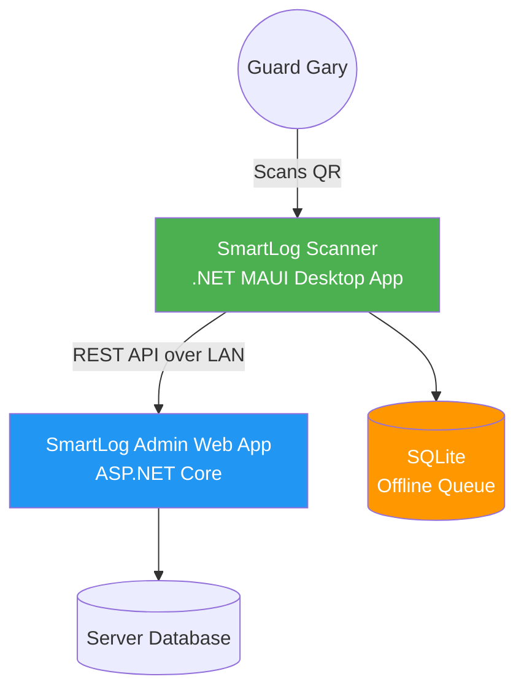
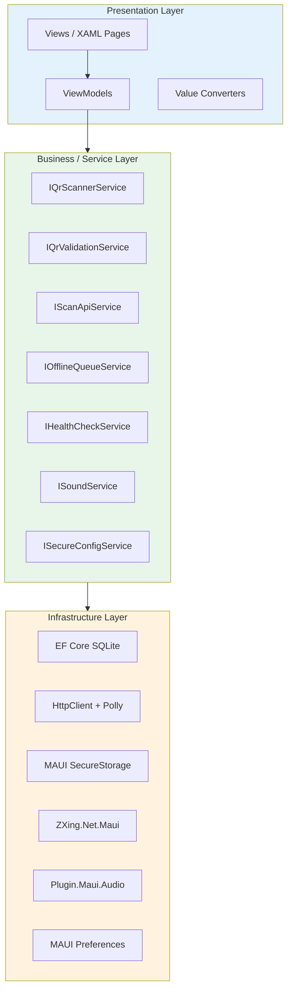
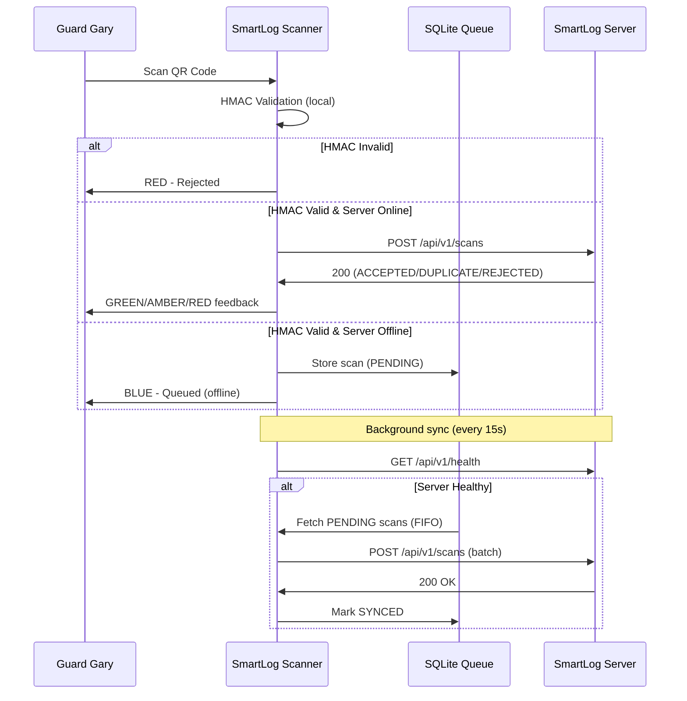

# Technical Requirements Document

**Project:** SmartLog Scanner
**Version:** 1.0.0
**Status:** Draft
**Last Updated:** 2026-02-13
**PRD Reference:** [PRD](prd.md)

---

## 1. Executive Summary

### Purpose
Define the technical architecture, technology decisions, and implementation patterns for SmartLog Scanner — a cross-platform .NET MAUI desktop application that provides offline-capable QR-based student attendance scanning on Windows and macOS.

### Scope
- Desktop client application only (not the SmartLog Admin Web App server)
- QR scanning input (camera and USB), local HMAC validation, server API communication, offline queue, and background sync
- Deployment on school gate Windows PCs and macOS machines

### Key Decisions
- .NET MAUI for cross-platform desktop (Windows + macOS) from a single codebase
- MVVM with CommunityToolkit.Mvvm for clean separation and testability
- SQLite via EF Core for local offline scan queue
- MAUI SecureStorage for encrypted credential storage (Keychain / DPAPI)
- Polly for HTTP resilience (retry + circuit breaker)
- Local HMAC-SHA256 validation before any server communication

---

## 2. Project Classification

**Project Type:** Desktop Application

**Classification Rationale:** SmartLog Scanner is a locally installed application running on Windows and macOS gate machines. It has a rich local UI, performs local data processing (HMAC validation), stores data locally (SQLite queue), and communicates with a remote server as a client. It does not serve a web frontend or expose APIs.

**Architecture Implications:**
- **Default Pattern:** Layered / Clean Architecture
- **Pattern Used:** MVVM with Layered Services
- **Deviation Rationale:** MVVM is the standard pattern for XAML-based UI frameworks (.NET MAUI). The layered service architecture underneath follows clean architecture principles — ViewModels depend on service interfaces, services are injected via DI, and infrastructure concerns (SQLite, HTTP, SecureStorage) are isolated behind abstractions.

---

## 3. Architecture Overview

### System Context
SmartLog Scanner operates as a thick client on school gate machines. It receives QR code input from cameras or USB barcode scanners, validates codes locally, and communicates with the SmartLog Admin Web App server over the school LAN via REST API. When the server is unreachable, scans are queued locally in SQLite and synced automatically when connectivity resumes.



### Architecture Pattern
**MVVM (Model-View-ViewModel) with Layered Services**

**Rationale:** MVVM is the natural pattern for .NET MAUI / XAML applications. CommunityToolkit.Mvvm provides source-generated ObservableProperty and RelayCommand attributes, reducing boilerplate. The layered service architecture beneath the ViewModels provides clean separation of concerns: Views know only about ViewModels, ViewModels know only about service interfaces, and concrete service implementations are injected via DI.

### Component Overview

| Component | Responsibility | Technology |
|-----------|---------------|------------|
| Views (XAML Pages) | UI rendering, data binding, user input | .NET MAUI XAML, Shell navigation |
| ViewModels | UI state management, command handling, orchestration | CommunityToolkit.Mvvm |
| QR Scanner Service | QR code input from camera or USB keyboard wedge | ZXing.Net.Maui, raw key input handler |
| QR Validation Service | Local HMAC-SHA256 signature verification | System.Security.Cryptography |
| Scan API Service | HTTP communication with SmartLog server | HttpClient, Polly |
| Offline Queue Service | SQLite queue management, background sync | EF Core SQLite |
| Health Check Service | Server connectivity polling | HttpClient |
| Secure Config Service | Encrypted credential read/write | MAUI SecureStorage |
| Sound Service | Audio feedback for scan results | Plugin.Maui.Audio |
| Infrastructure/Converters | Value converters (status→color, bool→text) | MAUI IValueConverter |
| Infrastructure/Security | HMAC computation, constant-time comparison | CryptographicOperations |

### Layer Diagram



---

## 4. Technology Stack

### Core Technologies

| Category | Technology | Version | Rationale |
|----------|-----------|---------|-----------|
| Language | C# | 12 | First-class .NET MAUI support; strong type system for business logic; source generators for MVVM boilerplate reduction |
| Runtime | .NET | 8.0 LTS | Long-term support; mature cross-platform runtime; latest MAUI improvements |
| UI Framework | .NET MAUI | 8.0 | Single codebase targeting Windows (WinUI 3) and macOS (MacCatalyst); native platform integration for SecureStorage, camera, file system |
| MVVM Framework | CommunityToolkit.Mvvm | Latest | Source-generated ObservableProperty/RelayCommand; reduces boilerplate; official Microsoft community toolkit |
| MAUI Extensions | CommunityToolkit.Maui | Latest | Converters, behaviors, animations; complements CommunityToolkit.Mvvm |
| Database | SQLite via EF Core | EF Core 8.x | Embedded, zero-config, cross-platform; ideal for local-first offline queue; no external database server required |
| HTTP Client | HttpClient + Polly | .NET 8 built-in + Polly 8.x | Built-in HttpClient with IHttpClientFactory; Polly provides retry, circuit breaker, and timeout policies for LAN resilience |
| QR Scanning | ZXing.Net.Maui | Latest | MAUI-native QR decoding with camera integration; proven ZXing library |
| Audio | Plugin.Maui.Audio | Latest | Cross-platform audio playback (Windows + macOS); simple API for WAV file playback |
| Logging | Serilog | Latest | Structured logging; file + console sinks; widely adopted in .NET ecosystem |
| Secure Storage | MAUI SecureStorage | Built-in | Platform-native encryption (Keychain on macOS, DPAPI on Windows); no additional dependencies |

### Build & Development

| Tool | Purpose |
|------|---------|
| dotnet CLI | Build, test, publish |
| MSBuild | Project build system (.csproj) |
| xUnit | Unit and integration testing |
| Moq | Mocking framework for unit tests |
| dotnet format | Code formatting |
| .NET Analyzers | Static analysis and code quality |

### NuGet Packages

| Package | Purpose |
|---------|---------|
| CommunityToolkit.Mvvm | MVVM source generators |
| CommunityToolkit.Maui | MAUI converters, behaviors |
| Microsoft.EntityFrameworkCore.Sqlite | SQLite ORM |
| Microsoft.EntityFrameworkCore.Design | EF Core migrations tooling |
| ZXing.Net.Maui | QR code camera scanning |
| Plugin.Maui.Audio | Audio playback |
| Serilog | Logging core |
| Serilog.Sinks.File | Log file output |
| Serilog.Sinks.Console | Console log output |
| Serilog.Extensions.Logging | Microsoft.Extensions.Logging integration |
| Microsoft.Extensions.Http.Polly | HttpClient resilience policies |
| Microsoft.Extensions.Configuration.Json | appsettings.json configuration |

---

## 5. API Contracts

### API Style
REST over HTTPS (or HTTP for local dev). JSON request/response bodies.

### Authentication
API Key in `X-API-Key` HTTP header. Key provisioned during device registration in SmartLog Admin Web App.

### Endpoints Consumed

| Method | Path | Description | Auth |
|--------|------|-------------|------|
| POST | /api/v1/scans | Submit scan data | X-API-Key |
| GET | /api/v1/health | Basic health check | None |
| GET | /api/v1/health/details | Detailed health (setup validation) | X-API-Key |

### POST /api/v1/scans

**Request:**
```json
{
  "qrPayload": "SMARTLOG:STU-2026-001:1706918400:abc123hmac",
  "scannedAt": "2026-02-04T08:15:00Z",
  "scanType": "ENTRY"
}
```

**Success Response (200, status=ACCEPTED):**
```json
{
  "scanId": "guid",
  "studentId": "STU-2026-001",
  "studentName": "Maria Santos",
  "grade": "5",
  "section": "A",
  "scanType": "ENTRY",
  "scannedAt": "2026-02-04T08:15:00Z",
  "status": "ACCEPTED"
}
```

**Duplicate Response (200, status=DUPLICATE):**
```json
{
  "scanId": "original-guid",
  "studentId": "STU-2026-001",
  "studentName": "Maria Santos",
  "grade": "5",
  "section": "A",
  "scanType": "ENTRY",
  "scannedAt": "2026-02-04T08:15:00Z",
  "status": "DUPLICATE",
  "originalScanId": "original-guid",
  "message": "Already scanned. Please proceed."
}
```

### Error Response Format
```json
{
  "error": "InvalidQrCode",
  "message": "Human-readable error description",
  "status": "REJECTED"
}
```

**Error Codes:**

| HTTP Status | Error Code | Meaning |
|-------------|-----------|---------|
| 400 | InvalidQrCode | Malformed or unrecognized QR payload |
| 400 | StudentInactive | Student account is inactive |
| 400 | QrCodeInvalidated | QR code has been revoked |
| 401 | InvalidApiKey | Missing or invalid API key |
| 429 | (rate limit) | Too many requests; respect Retry-After header |

### GET /api/v1/health

**Response (200):**
```json
{
  "status": "healthy",
  "timestamp": "2026-02-04T08:15:00Z",
  "version": "1.0.0"
}
```

### GET /api/v1/health/details

**Response (200):**
```json
{
  "status": "healthy",
  "database": { "status": "healthy", "latencyMs": 5 },
  "uptime": "2d 5h 30m",
  "activeScanners": 3,
  "scansToday": 1250
}
```

---

## 6. Data Architecture

### Data Models

#### QueuedScan (SQLite Entity)

| Field | Type | Constraints | Description |
|-------|------|-------------|-------------|
| Id | int | PK, AUTOINCREMENT | Unique queue entry ID |
| QrPayload | string | NOT NULL | Full QR code payload string |
| ScannedAt | string | NOT NULL | ISO 8601 timestamp of when scan occurred |
| ScanType | string | NOT NULL | "ENTRY" or "EXIT" |
| CreatedAt | string | NOT NULL | ISO 8601 timestamp of when queued |
| SyncStatus | string | NOT NULL, DEFAULT "PENDING" | PENDING, SYNCED, or FAILED |
| SyncAttempts | int | NOT NULL, DEFAULT 0 | Number of sync retry attempts |
| LastSyncError | string? | NULLABLE | Most recent sync error message |
| ServerScanId | string? | NULLABLE | Server-assigned scan GUID after successful sync |

#### ScanResult (API Response DTO)

| Field | Type | Description |
|-------|------|-------------|
| ScanId | string | Server-assigned GUID |
| StudentId | string | Student identifier (e.g., STU-2026-001) |
| StudentName | string | Full display name |
| Grade | string | Grade level |
| Section | string | Section identifier |
| ScanType | string | ENTRY or EXIT |
| ScannedAt | DateTime | Scan timestamp |
| Status | string | ACCEPTED, DUPLICATE, or REJECTED |
| OriginalScanId | string? | Original scan ID (duplicates only) |
| Message | string? | Additional message (duplicates/errors) |
| Error | string? | Error code (errors only) |

#### StudentInfo (View Display Model)

| Field | Type | Description |
|-------|------|-------------|
| StudentName | string | Display name (large text) |
| Grade | string | Grade level |
| Section | string | Section identifier |
| StudentId | string | Student ID string |
| ScanType | string | ENTRY or EXIT |
| ScannedAt | DateTime | Scan time for display |
| Status | ScanStatus enum | ACCEPTED, DUPLICATE, REJECTED, QUEUED, IDLE |

### Storage Strategy

| Data Type | Storage | Rationale |
|-----------|---------|-----------|
| Offline scan queue | SQLite (EF Core) at FileSystem.AppDataDirectory | Embedded, zero-config, survives app restarts, supports FIFO queries |
| API key | MAUI SecureStorage | Platform-native encryption (Keychain / DPAPI) |
| HMAC secret | MAUI SecureStorage | Platform-native encryption (Keychain / DPAPI) |
| Runtime preferences | MAUI Preferences | Simple key-value for non-sensitive settings |
| Bundled defaults | appsettings.json (MauiAsset) | Read-only default configuration shipped with app |
| Audit logs | Serilog file sink at FileSystem.AppDataDirectory/logs/ | Structured log files for troubleshooting |

### Migrations
EF Core code-first migrations. Initial migration creates the QueuedScan table. Database auto-created on first launch at `FileSystem.AppDataDirectory/scanner_queue.db`.

---

## 7. Integration Patterns

### External Services

| Service | Purpose | Protocol | Auth |
|---------|---------|----------|------|
| SmartLog Admin Web App | Scan submission, health check, setup validation | REST/HTTPS over LAN | API Key (X-API-Key header) |

### Communication Pattern



### Resilience Patterns

| Pattern | Implementation | Configuration |
|---------|---------------|---------------|
| Retry | Polly retry policy on HttpClient | 3 retries with exponential backoff |
| Circuit Breaker | Polly circuit breaker on HttpClient | Break after 5 consecutive failures, 30s recovery |
| Timeout | HttpClient timeout | 10 seconds (configurable) |
| Rate Limiting | Client-side throttle | Max 60 scans/minute; respect 429 Retry-After |
| Offline Queue | SQLite FIFO queue | Max 10 retry attempts per scan before FAILED |
| Health Polling | Background timer | Every 15 seconds (configurable) |

### Event Architecture
Not applicable — no message queues or event buses. All communication is synchronous REST with background polling for health checks and queue sync.

---

## 8. Infrastructure

### Deployment Topology
Standalone desktop application installed directly on school gate machines. No cloud infrastructure, containers, or server-side deployment required for the scanner itself.

| Component | Deployment Target |
|-----------|------------------|
| SmartLog Scanner | Windows PCs (MSIX) and macOS machines (.app bundle) |
| SQLite database | Local file on each machine |
| Logs | Local file on each machine |
| SmartLog Server | Deployed separately (not in scope for this TRD) |

### Environment Strategy

| Environment | Purpose | Characteristics |
|-------------|---------|-----------------|
| Development | Local development and debugging | Runs on developer machine; mock server or local SmartLog instance; debug logging |
| Test | Automated testing | xUnit test project; in-memory SQLite for unit tests; mock HTTP handlers |
| Production | Live school gate machines | Installed via MSIX/app bundle; connects to school LAN SmartLog server; info-level logging |

### Platform Targets

| Platform | Target Framework | Packaging |
|----------|-----------------|-----------|
| Windows | net8.0-windows10.0.19041.0 | MSIX |
| macOS | net8.0-maccatalyst | .app bundle |

### Scaling Strategy
Not applicable — each scanner is a standalone desktop installation. Horizontal scaling is achieved by deploying to additional gate machines, each independently configured with its own API key.

---

## 9. Security Considerations

### Threat Model

| Threat | Likelihood | Impact | Mitigation |
|--------|-----------|--------|------------|
| Forged QR code presented | Medium | High | Local HMAC-SHA256 validation with constant-time comparison before server submission |
| API key exposure | Low | High | Stored in MAUI SecureStorage (Keychain/DPAPI); never in plain text files or logs |
| HMAC secret exposure | Low | Critical | Stored in MAUI SecureStorage; never logged or transmitted |
| Man-in-the-middle on LAN | Low | Medium | HTTPS with TLS; self-signed cert support for LAN deployment |
| Timing attack on HMAC comparison | Low | Medium | CryptographicOperations.FixedTimeEquals() for constant-time comparison |
| Unauthorized scanner device | Low | Medium | API key per device; server can revoke individual device keys |
| SQLite database tampering | Low | Low | Local file; queued scans re-validated by server on sync |
| Replay attack (same QR scanned repeatedly) | Medium | Low | Server-side duplicate detection; client debounce (2s for camera) |

### Security Controls

| Control | Implementation |
|---------|----------------|
| Authentication | API key in X-API-Key header; key stored in MAUI SecureStorage |
| Secret Storage | MAUI SecureStorage (macOS Keychain, Windows DPAPI) |
| QR Validation | HMAC-SHA256 with CryptographicOperations.FixedTimeEquals() |
| Encryption in Transit | HTTPS/TLS; ServerCertificateCustomValidationCallback for self-signed LAN certs |
| Encryption at Rest | SecureStorage handles platform-native encryption; SQLite queue is not encrypted (contains only QR payloads, no secrets) |
| Input Validation | QR payload parsed and validated locally before any processing |
| Logging Safety | API keys and HMAC secrets excluded from all log output |

---

## 10. Performance Requirements

### Targets

| Metric | Target | Measurement |
|--------|--------|-------------|
| Scan-to-feedback (online) | < 500ms (excluding network RTT) | Time from QR decode to UI update |
| Scan-to-feedback (offline) | < 100ms | Time from QR decode to "Queued" display |
| Camera QR decode rate | >= 15 fps | ZXing.Net.Maui frame processing |
| USB scanner input processing | < 50ms | Time from final keystroke to validation |
| Background sync (no UI block) | 0ms UI thread impact | Background thread with MainThread.InvokeOnMainThreadAsync for updates |
| Auto-clear display | 3 seconds | Timer-based reset to idle state |
| Health check polling | Every 15 seconds | Background timer |
| SQLite queue capacity | 10,000+ pending scans | No degradation with large queue |

---

## 11. Architecture Decision Records

### ADR-001: .NET MAUI over WPF and Electron

**Status:** Accepted

**Context:** The scanner must run on both Windows and macOS gate machines. WPF is Windows-only. Electron adds complexity (Node.js runtime, Chromium overhead) and is not aligned with the existing .NET ecosystem of the SmartLog Admin Web App.

**Decision:** Use .NET MAUI targeting net8.0-maccatalyst and net8.0-windows10.0.19041.0.

**Consequences:**
- Positive: Single C# codebase for both platforms; native platform integration (SecureStorage, camera, file system); consistent with SmartLog server's .NET ecosystem
- Negative: MAUI desktop is less mature than WPF for Windows-only scenarios; some platform-specific code needed (Info.plist, Package.appxmanifest)

### ADR-002: MVVM with CommunityToolkit.Mvvm

**Status:** Accepted

**Context:** Need a clear pattern for separating UI from business logic in a XAML-based application, with strong testability for ViewModels.

**Decision:** Use CommunityToolkit.Mvvm with source-generated ObservableProperty and RelayCommand attributes.

**Consequences:**
- Positive: Minimal boilerplate; ViewModels are pure C# classes testable without UI; official Microsoft community toolkit with active maintenance
- Negative: Source generators require understanding of attribute-based patterns

### ADR-003: SQLite via EF Core for Offline Queue

**Status:** Accepted

**Context:** Need local persistent storage for offline scan queue that survives app restarts and crashes. Must work on both Windows and macOS without external database installation.

**Decision:** Use SQLite via Microsoft.EntityFrameworkCore.Sqlite with code-first migrations.

**Consequences:**
- Positive: Zero-config embedded database; cross-platform; ACID transactions; EF Core provides familiar LINQ querying and migration tooling
- Negative: Not suitable for concurrent multi-process access (single-app use is fine); EF Core adds some overhead vs raw SQLite

### ADR-004: MAUI SecureStorage for Credentials

**Status:** Accepted

**Context:** API key and HMAC secret must never be stored in plain text. Need platform-native encrypted storage on both Windows and macOS.

**Decision:** Use MAUI SecureStorage which wraps macOS Keychain and Windows DPAPI.

**Consequences:**
- Positive: Platform-native encryption; no additional dependencies; simple key-value API
- Negative: Limited to string values; storage may be inaccessible if OS keychain is locked (rare edge case)

### ADR-005: Local HMAC Validation Before Server Submission

**Status:** Accepted

**Context:** Invalid or forged QR codes should be rejected instantly without wasting network bandwidth or server resources. The shared HMAC secret enables client-side verification.

**Decision:** Validate QR codes locally using HMAC-SHA256 with CryptographicOperations.FixedTimeEquals() before any server communication.

**Consequences:**
- Positive: Instant rejection of forged QR codes; reduced server load; works offline; constant-time comparison prevents timing attacks
- Negative: Requires HMAC secret to be distributed to each scanner (managed via setup wizard + SecureStorage)

### ADR-006: Polly for HTTP Resilience

**Status:** Accepted

**Context:** School LAN connectivity is variable. HTTP calls to the SmartLog server may fail transiently due to network issues, server restarts, or load spikes.

**Decision:** Use Polly via Microsoft.Extensions.Http.Polly to configure retry, circuit breaker, and timeout policies on the named HttpClient.

**Consequences:**
- Positive: Automatic retries for transient failures; circuit breaker prevents hammering a down server; integrates cleanly with IHttpClientFactory
- Negative: Adds complexity to HTTP configuration; retry policies must be tuned to avoid excessive retries during genuine outages

### ADR-007: Self-Signed TLS Certificate Support

**Status:** Accepted

**Context:** School LAN deployments commonly use self-signed TLS certificates. The scanner must connect over HTTPS without requiring a CA-issued certificate.

**Decision:** Configure HttpClientHandler with ServerCertificateCustomValidationCallback to accept self-signed certificates when "AcceptSelfSignedCerts" is true. Log a warning when active.

**Consequences:**
- Positive: Works with typical school LAN infrastructure; configurable per deployment
- Negative: Reduces TLS security when enabled; must be clearly documented as a LAN-only configuration

---

## 12. Open Technical Questions

- [ ] **Q:** Which ZXing.Net.Maui package variant to use?
  **Context:** ZXing.Net.Maui vs ZXing.Net.Maui.Controls — need to verify desktop (non-mobile) camera support on both macOS and Windows.

- [ ] **Q:** HMAC secret key format from admin panel?
  **Context:** Need to know if the shared secret is provided as a raw string, hex-encoded, or base64-encoded for correct SecureStorage handling and HMAC computation.

- [ ] **Q:** Should the scanner validate QR timestamp expiry locally?
  **Context:** The QR payload includes a Unix timestamp. Currently only HMAC signature is validated locally; time-based expiry may be handled server-side. Need to confirm if client should also reject expired QR codes.

- [ ] **Q:** Fallback strategy when MAUI SecureStorage is unavailable?
  **Context:** On macOS, Keychain access could be denied. Need to decide: show error and block operation, or provide a degraded mode.

---

## 13. Implementation Constraints

### Must Have
- Cross-platform: must run on both Windows 10+ and macOS (MacCatalyst)
- Offline-capable: full scan validation and queuing without network
- Instant feedback: < 500ms scan-to-result for Guard Gary
- Secure credential storage: no plain text secrets anywhere
- Constant-time HMAC comparison: CryptographicOperations.FixedTimeEquals()
- Background sync must never block the UI thread
- All scans logged via Serilog for audit trail

### Won't Have (This Version)
- Multi-language / localization support
- Remote management / configuration push
- Automatic software updates (OTA)
- Student photo display (server doesn't provide photos in scan response)
- Offline student name resolution (names only available when server responds)
- Multi-monitor / multi-scanner-per-machine support
- Admin/settings screen accessible during scanning (setup is one-time)

---

## Changelog

| Date | Version | Changes |
|------|---------|---------|
| 2026-02-13 | 1.0.0 | Initial TRD — .NET MAUI cross-platform, MVVM architecture, 7 ADRs |
